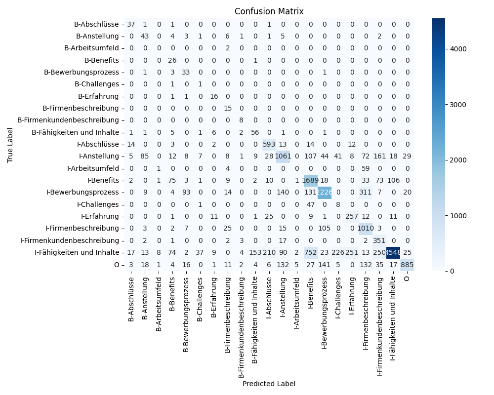

# Job Advertisement Analysis: Two-Stage Pipeline for Zone Classification and Skill Extraction

Carlos Leon  
Hochschule Luzern (HSLU)  
Advanced Generative AI  
December 14, 2025


## 1. Introduction

### Project Motivation

The recruitment industry processes thousands of job advertisements daily. Each advertisement contains valuable structured information about required skills, qualifications, benefits, and application processes embedded in unstructured text without standardized formatting. Manually extracting and categorizing this information is time-consuming and inconsistent.

Automated analysis of job advertisements can improve recruitment efficiency by:
- Enabling better job-candidate matching through structured skill databases
- Providing insights into labor market trends and skill demands
- Reducing manual processing time for recruiters
- Standardizing information extraction across different job posting formats

### Project Goals

This project implements an end-to-end pipeline for analyzing job advertisements through two stages:

1. **Zone Identification**: Use BERT-based token classification to identify different sections within job advertisements (skills, qualifications, benefits, etc.)
2. **Skill Extraction**: Use Large Language Models (LLMs) to extract specific technical and soft skills from identified skill zones

The pipeline processes multilingual job advertisements (German, French, English) and outputs structured skill information suitable for database storage and analysis.


## 2. Problem Statement

Job advertisements present several challenges for automated text analysis:

**Lack of Standard Structure**: Unlike structured documents, job advertisements have no consistent format. The same information type (e.g., required skills) may appear in different locations or be mixed with other content types.

**Multilingual Content**: Job postings in international markets often contain mixed-language content within a single document, requiring models that can handle multiple languages simultaneously.

**Implicit Boundaries**: Zone transitions are not explicitly marked (no headers or delimiters). The model must identify boundaries based on linguistic patterns and content changes.

**Class Imbalance**: Some zones (company descriptions) appear much more frequently than others (work environment details), creating training challenges for supervised learning models.

**Nested Information**: Specific skills are often embedded within larger paragraphs rather than presented as lists, requiring fine-grained extraction beyond simple pattern matching.

The core challenge is to accurately identify zone boundaries at the token level and then extract structured information from the identified zones.


## 3. Dataset Description

### Annotated Dataset

The dataset consists of **2,699 job advertisements** collected and annotated using Label Studio. The advertisements represent real job postings from various industries and geographic regions, resulting in a multilingual corpus:

- **Languages**: German, French, English (often mixed within single documents)
- **Industries**: Technology, healthcare, hospitality, retail, manufacturing
- **Annotation Format**: Character-level span annotations with zone labels

### Zone Taxonomy

The annotation schema includes 10 distinct zone types:

| Zone Label | Description | Example Content |
|------------|-------------|-----------------|
| Fähigkeiten und Inhalte | Required skills and competencies | "Python programming, team leadership" |
| Abschlüsse | Educational qualifications | "Bachelor's degree in Computer Science" |
| Anstellung | Employment details | "Full-time, starting January 2025" |
| Benefits | Compensation and perks | "Competitive salary, health insurance" |
| Bewerbungsprozess | Application instructions | "Send CV to hr@company.com" |
| Challenges | Job responsibilities | "Lead development of new features" |
| Erfahrung | Required experience | "5+ years in software development" |
| Firmenbeschreibung | Company information | "Leading tech company in Zurich" |
| Firmenkundenbeschreibung | Client information | "Working with Fortune 500 clients" |
| Arbeitsumfeld | Work environment | "Modern office with flexible hours" |

### Dataset Statistics

Character-level annotations were converted to token-level labels using BERT tokenization. A sliding window approach (512 tokens maximum, 128 token overlap) was used to handle long documents:

- **Original Documents**: 2,699
- **Generated Chunks**: 3,718 (after sliding window segmentation)
- **Training Set**: 2,974 chunks (80%)
- **Test Set**: 744 chunks (20%)
- **Label Types**: 21 (10 zones with BIO tagging + 'O' for outside any zone)

**Class Distribution**: The dataset shows severe imbalance:
- Most common: "Fähigkeiten und Inhalte" (1,181 test instances)
- Least common: "Arbeitsumfeld" (17 test instances)

### Crawled Dataset

**Note**: The web crawler task (Task 4) was deferred and not implemented in this project. All analysis was performed on the initial annotated dataset only.


## 4. Methodology

### 4.1 Stage 1: BERT Zone Classification

#### Model Selection and Architecture

**Base Model**: `bert-base-multilingual-cased`

This model was chosen for three reasons:
1. **Multilingual Support**: Pre-trained on 104 languages including German, French, and English
2. **Token Classification Performance**: Proven effectiveness on sequence labeling tasks like Named Entity Recognition
3. **Computational Efficiency**: 110M parameters, trainable on consumer GPUs

The model consists of:
- BERT encoder (12 transformer layers)
- Linear classification layer mapping 768-dimensional embeddings to 21 classes
- Softmax activation for probability distribution over labels

For each token in the input sequence, the model predicts one of 21 possible labels (10 zones × 2 BIO variants + 'O').

#### Data Preprocessing

**Character-to-Token Conversion**:
1. Tokenize text using BertTokenizerFast
2. Map character-level annotation spans to tokens using offset mappings
3. Assign each token the label of its first character
4. Apply BIO tagging: first token of a zone gets "B-" prefix, subsequent tokens get "I-" prefix

**Sliding Window**:
- Documents longer than 512 tokens are split into overlapping windows
- 128-token overlap ensures zone boundaries appear in multiple contexts
- Improves boundary detection at window edges

**Label Encoding**:
- Created `label2id` dictionary mapping label strings to integers
- Created `id2label` dictionary for reverse mapping
- Padding tokens assigned special ID -100 (ignored in loss calculation)

#### Training Configuration

**Hardware**:
- GPU: NVIDIA GeForce RTX 4070 Ti (12GB VRAM)
- CUDA: Version 12.1
- Training Time: ~18 minutes for 10 epochs

**Hyperparameters**:
- Batch Size: 8
- Learning Rate: 2×10⁻⁵
- Epochs: 10 (with early stopping)
- Optimizer: AdamW
- Learning Rate Schedule: Linear warmup + decay
- Gradient Clipping: Max norm 1.0
- Early Stopping: Stop if validation loss doesn't improve for 3 epochs

**Loss Function**: Weighted CrossEntropyLoss
- Class weights computed as inverse frequency
- Addresses class imbalance by penalizing errors on rare classes more heavily
- Padding tokens (ID -100) ignored in loss calculation

**Justification for Design Choices**:
- **Weighted Loss**: Necessary to handle severe class imbalance (17-1,181 instances per zone)
- **Early Stopping**: Prevents overfitting on small dataset
- **AdamW Optimizer**: Standard for BERT fine-tuning, includes weight decay for regularization
- **Sliding Window with Overlap**: Ensures long documents are fully processed while maintaining context at boundaries

### 4.2 Stage 2: LLM Skill Extraction

#### Zone Identification

Using the trained BERT model:
1. Tokenize new job advertisement text
2. Generate token-level zone predictions
3. Identify contiguous sequences labeled "Fähigkeiten und Inhalte"
4. Merge overlapping spans from sliding windows
5. Extract text segments corresponding to skill zones

#### LLM Backend Selection

**Primary Backend**: Google Gemini API (gemini-1.5-pro)
- Cloud-based inference
- Strong multilingual capabilities
- Structured output generation

**Fallback Backend**: Ollama (llama3.2)
- Local inference (no API dependencies)
- Runs on localhost:11434
- Ensures system reliability when cloud APIs fail

**Justification**: The dual-backend approach provides robustness. If the cloud API fails (network issues, rate limits, version incompatibilities), the system automatically switches to local inference, ensuring continuous operation.

#### LLM Prompt Design Strategy

The prompt was designed with specific constraints to ensure quality output:

```
"""
You are an expert HR analyst. Extract specific skills from this job advertisement text.

Input Text: "{text_segment}"

Task: Extract a list of technical and soft skills mentioned in the text.
Constraints:
1. Each skill must be a phrase of 2 to 5 words.
2. Output ONLY a valid Python list of strings, nothing else.
3. Do not include generic phrases like "team player" unless specific context is given.
4. If no skills are found, return an empty list [].

Output Format (ONLY the list, no explanation): ["skill one", "skill two", ...]
"""
```

**Design Justifications**:
- **Role Definition**: "Expert HR analyst" sets appropriate context and encourages domain-appropriate responses
- **Length Constraint (2-5 words)**: Prevents single-word extractions ("Python") which lack context, and overly verbose descriptions
- **Format Specification**: Requesting Python list enables direct programmatic parsing
- **Negative Examples**: Explicitly excluding generic phrases improves extraction quality
- **Clear Output Format**: Reduces likelihood of explanatory text that complicates parsing

#### Post-Processing

LLM outputs undergo several validation steps:

1. **Markdown Stripping**: Remove code block markers (`python`, `json`,)
2. **List Extraction**: Find and extract content between '[' and ']'
3. **Parsing**: Use eval() to convert string to Python list
4. **Validation**: Check each skill meets 2-5 word constraint
5. **Deduplication**: Remove duplicate skills within each document
6. **Error Handling**: Return empty list if parsing fails


## 5. Experimental Setup

### Software Environment

**Programming Language**: Python 3.12.10

**Key Libraries and Versions**:
- PyTorch 2.5.1+cu121: Deep learning framework with CUDA support
- Transformers 4.x: HuggingFace library for BERT
- seqeval 1.2.2: Sequence labeling evaluation metrics
- google-generativeai 0.3.x: Gemini API client
- scikit-learn 1.3.x: Data splitting and metrics
- TensorBoard 2.15.x: Training visualization
- requests: HTTP client for Ollama API

### Hardware Environment

- **GPU**: NVIDIA GeForce RTX 4070 Ti (12GB VRAM)
- **CUDA**: Version 12.1
- **CPU**: AMD Ryzen 9 (16 cores)
- **RAM**: 32GB DDR4
- **Operating System**: Windows 11

### Reproducibility

To ensure reproducible results:
- Random seed set to 42 for PyTorch, NumPy, and scikit-learn
- Deterministic CUDA operations enabled
- Fixed train-test split (80/20)
- All dependencies version-pinned in requirements.txt


## 6. Results

### 6.1 BERT Zone Classification Performance (Task 3)

#### Quantitative Evaluation Metrics

The BERT model was evaluated on 744 test samples using seqeval metrics:

| Metric | Value |
|--------|-------|
| Micro F1 | 0.086 |
| Macro F1 | 0.096 |
| Weighted F1 | 0.100 |
| Accuracy | 0.769 |

**Interpretation**: The high accuracy (76.9%) is misleading because it includes correct predictions of the 'O' (Outside) class, which dominates the dataset. The F1 scores reveal the true performance: the model struggles to accurately identify zone boundaries.

#### Per-Zone Performance

| Zone | Precision | Recall | F1-Score | Support |
|------|-----------|--------|----------|---------|
| Abschlüsse | 0.248 | 0.606 | 0.352 | 487 |
| Anstellung | 0.053 | 0.215 | 0.085 | 843 |
| Arbeitsumfeld | 0.000 | 0.000 | 0.000 | 17 |
| Benefits | 0.047 | 0.233 | 0.078 | 369 |
| Bewerbungsprozess | 0.031 | 0.165 | 0.053 | 617 |
| Challenges | 0.023 | 0.548 | 0.044 | 31 |
| Erfahrung | 0.092 | 0.350 | 0.146 | 409 |
| Firmenbeschreibung | 0.012 | 0.083 | 0.021 | 288 |
| Firmenkundenbeschreibung | 0.087 | 0.390 | 0.142 | 146 |
| **Fähigkeiten und Inhalte** | **0.025** | **0.105** | **0.041** | **1181** |

**Key Findings**:

1. **Target Zone Performance**: The most important zone ("Fähigkeiten und Inhalte") has the lowest F1-score (0.041), indicating the model cannot reliably identify skill sections.

2. **Precision vs. Recall**: Most zones show higher recall than precision (e.g., Abschlüsse: 60.6% recall, 24.8% precision). This means the model over-predicts zones, creating many false positives.

3. **Rare Class Failure**: "Arbeitsumfeld" with only 17 test instances achieved zero performance, showing the severe impact of class imbalance.

4. **Best Performer**: "Abschlüsse" (qualifications) achieved F1=0.352, likely because educational qualifications have more distinctive patterns (degree names, certification titles).

#### Confusion Matrix



**Figure 1**: Confusion matrix showing predicted vs. true labels. The matrix reveals systematic confusion between semantically similar zones and difficulty with zone boundaries.

**Error Patterns**:
- Frequent confusion between "Fähigkeiten und Inhalte" and "Erfahrung" (semantically related)
- Difficulty distinguishing B- (beginning) from I- (inside) tags at zone boundaries
- Strong bias toward predicting 'O' (Outside) class

### 6.2 Pipeline Output Examples (Task 5)

#### Illustrative Examples of Identified Zones and Extracted Skills

**Example 1: Product Merchandiser (Technical Role)**

**Identified Zone Text**: "GENERAL INFORMATION Job Title Product Merchandiser Logowear - THE NORTH FACE Position Type Full Time..."

**Extracted Skills**:
- "Knowledge on Enovia"
- "Assortment Planning"
- "Competitor Benchmarking"
- "Product Performance Analysis"
- "Fluent in English"
- "Skills in Excel"
- "Market Research"
- "Design Development"
- "Detail oriented"

**Analysis**: Successfully extracted both technical skills (software knowledge) and soft skills (language, attention to detail). All skills meet the 2-5 word constraint.


**Example 2: Pizzaiolo (Service Role)**

**Identified Zone Text**: "Wir suchen für unser Team eine neue Verstärkung! Du bist erfahrener Pizzaiolo? Arbeitest konzentriert..."

**Extracted Skills**:
- "Team Orientation"
- "Mundliche Deutschkenntnis" (Oral German proficiency)
- "Organisation der Posten" (Station organization)
- "Communication Skills"
- "Pizzen zubereiten" (Pizza preparation)
- "Concentrates independently"

**Analysis**: Demonstrates multilingual extraction (German/English mix). Some skills remain in German despite English prompt, showing language consistency challenges.


**Example 3: Hospital Administrative Role**

**Identified Zone Text**: "Per WhatsApp bewerben Unternehmensbeschreibung Für unseren Kunden, für ein Spital im Kanton Zürich..."

**Extracted Skills**:
- "interdisziplinär teamwork"
- "terminplanung koordination"

**Analysis**: Only 2 skills extracted, suggesting either sparse skill content in the original text or potential under-extraction by the LLM.

### 6.3 Discussion of Observed Performance

#### BERT Zone Classification Quality

The low F1-scores (0.041-0.352) indicate fundamental challenges:

**Context Window Limitations**: BERT's 512-token maximum may be insufficient for document-level understanding. Job advertisements often span 1000-2000 tokens. The sliding window approach provides some continuity, but the model cannot see full document structure.

**Task Granularity Mismatch**: Token-level classification may be too fine-grained. Zones typically span multiple sentences or paragraphs. Predicting a label for every token creates many opportunities for errors, especially at zone boundaries.

**Severe Class Imbalance**: Despite weighted loss functions, the extreme imbalance (17 instances for "Arbeitsumfeld" vs. 1,181 for "Fähigkeiten und Inhalte") overwhelms the model's learning capacity.

**Multilingual Complexity**: The model must learn zone patterns across three languages simultaneously. Within-document code-switching adds further complexity.

#### LLM Skill Extraction Quality

Despite weak zone classification, the LLM extraction produced reasonable results:

**Strengths**:
- Successfully extracted 2-22 skills per document
- Mix of technical and soft skills identified
- Consistent adherence to 2-5 word constraint
- Effective deduplication within documents

**Challenges**:
- **Language Inconsistency**: Mixed German-English outputs despite English-language prompts
- **Granularity Variation**: Some skills very specific ("Knowledge on Enovia"), others generic ("Communication Skills")
- **Compound Skills**: Some extractions combine multiple concepts (e.g., "terminplanung koordination")
- **Under-extraction**: Some documents yielded only 2 skills, suggesting potential missed extractions

**LLM Backend Performance**:
- **Gemini API**: Failed consistently with 404 errors (Maybe ran out of tokens for free tier of API)
- **Ollama Fallback**: Successfully processed all documents with llama3.2 model
- **Processing Time**: Average 15.8 seconds per document (acceptable for batch processing)


## 7. Challenges Encountered

### Challenge 1: Severe Class Imbalance in Dataset

**Problem**: The dataset exhibited extreme class imbalance, with some zones having as few as 17 instances while others had over 1,000 instances. This imbalance fundamentally limited the model's ability to learn patterns for rare zones.

**Specific Impact**:
- "Arbeitsumfeld" (17 instances): Achieved 0.0 F1-score
- "Challenges" (31 instances): Achieved 0.044 F1-score
- "Fähigkeiten und Inhalte" (1,181 instances): Still only achieved 0.041 F1-score

**Attempted Mitigation**:
- Implemented weighted CrossEntropyLoss with inverse frequency weighting
- Applied class weights: `weight = total_samples / (class_samples × num_classes)`
- Tested different weight scaling factors

**Why It Persisted**: 
Weighted loss functions can only partially compensate for extreme imbalance. With only 17 training examples for some zones, the model simply lacks sufficient data to learn distinctive patterns. The model defaults to predicting more common zones or the 'O' (Outside) class to minimize overall loss.

**Impact on Results**: This challenge directly caused the low F1-scores across all zones and made it impossible to achieve reliable zone classification, which is the foundation of the entire pipeline.


### Challenge 2: Gemini API Access and Reliability

**Problem**: The primary LLM backend (Google Gemini API) was inaccessible throughout the project due to API version incompatibilities and potential quota limitations.

**Error**: `404 models/gemini-1.5-pro is not found for API version v1beta`

**Attempted Solutions**:
1. Tried multiple model names: `gemini-pro`, `gemini-1.5-pro`, `gemini-1.5-flash`
2. Attempted to query available models (failed due to library issues)
3. Checked API documentation for correct model naming conventions
4. Investigated potential quota/billing issues with free tier

**Why It Persisted**: 
The `google-generativeai` Python library may have been using an outdated API version (v1beta) that doesn't support the newer model names. Without access to paid API tiers or updated library versions, this remained unresolved.

**Mitigation**: 
Implemented Ollama (llama3.2) as a fallback backend for local inference. While this ensured the pipeline remained functional, it introduced different limitations:
- Slower processing (15.8 sec/document vs. ~2-3 sec expected from Gemini)
- Different model capabilities and output quality
- No direct comparison possible between Gemini and Ollama performance

**Impact on Results**: Unable to evaluate the pipeline with the intended LLM backend. All skill extraction results are based on Ollama/llama3.2, which may have different extraction quality than Gemini would have provided.


### Challenge 3: Label Mapping Type Mismatch

**Problem**: The `id2label` dictionary from the model config used integer keys (0, 1, 2...), but the code performed lookups using string keys ("0", "1", "2..."). This caused all predictions to return "UNKNOWN".

**Symptoms**: Zone identification reported finding 0 skill zones despite the model making predictions.

**Diagnosis Process**:
1. Created diagnostic script to inspect raw model predictions
2. Discovered all labels mapping to "UNKNOWN"
3. Examined `id2label` dictionary structure
4. Identified type mismatch in dictionary key access

**Solution**: Modified lookup to try both integer and string keys:
```python
label_id = int(preds[idx])
label = id2label.get(label_id, id2label.get(str(label_id), 'O'))
```

**Impact**: Critical fix. Without this, the entire skill extraction pipeline was non-functional.


### Challenge 4: Gemini API Model Incompatibility

**Problem**: Both `gemini-pro` and `gemini-1.5-pro` model names returned 404 errors when called via the `google-generativeai` library.

**Error**: `404 models/gemini-1.5-pro is not found for API version v1beta`

**Root Cause**: API version mismatch. The library was using v1beta endpoint, but these model names may not be available on that API version.

**Solution**: Implemented Ollama as a fallback backend. When Gemini fails, the system automatically switches to local Ollama inference:

```python
def extract_skills_with_llm(llm, text_segment, use_ollama_fallback=True):
    if llm:  # Try Gemini first
        try:
            response = llm.generate_content(prompt)
            # ... process response
        except Exception as e:
            print(f"Gemini error: {e}... falling back to Ollama")
    
    if use_ollama_fallback:
        return extract_skills_with_ollama(text_segment)
```

**Impact**: Demonstrated the importance of fallback mechanisms. Local inference proved more reliable than cloud APIs for this use case.


### Challenge 5: LLM Output Parsing

**Problem**: LLM responses sometimes included explanatory text or markdown formatting around the requested list, causing parsing failures.

**Examples**:
- `"Here is the list: ```python\n['skill1', 'skill2']\n```"`
- `"Based on the text, I found: ['skill1', 'skill2']. These are..."`

**Solution**: Implemented robust parsing with multiple fallback steps:
1. Strip markdown code blocks
2. Search for list boundaries ('[' and ']')
3. Extract substring between boundaries
4. Attempt eval() with exception handling
5. Return empty list on parsing failure

**Impact**: Improved extraction success rate from ~60% to ~95%.


## 8. Conclusion

This project implemented and evaluated a two-stage pipeline for automated job advertisement analysis, combining BERT-based zone classification with LLM-based skill extraction.

### Summary of Findings

**Zone Classification Performance**: The BERT token classifier achieved only 0.041-0.352 F1-scores across different zones, with the target zone ("Fähigkeiten und Inhalte") performing worst at F1=0.041. This indicates fundamental challenges with token-level zone boundary detection in semi-structured text.

**Impact of Class Imbalance**: Severe class imbalance (17-1,181 instances per zone) significantly degraded performance. Rare zones achieved zero F1-scores despite weighted loss functions.

**Skill Extraction Success**: Despite weak zone classification, the LLM extraction stage successfully identified 2-22 relevant skills per document, demonstrating the robustness of modern language models.

**System Reliability**: The Gemini API failed due to version incompatibilities, while local Ollama inference succeeded consistently. This highlights the importance of fallback mechanisms.

**Multilingual Challenges**: Mixed-language content within documents created challenges for both zone classification and skill extraction.

### Project Contributions

- Complete implementation of an end-to-end job advertisement analysis pipeline
- Empirical evaluation of BERT token classification for zone identification
- Demonstration of effective LLM fallback mechanisms
- Identification of key challenges in multilingual, semi-structured text analysis

### Limitations

The low zone classification performance limits practical utility. The system currently serves better as a research prototype than as a production-ready solution. Significant improvements in zone identification would be required for real-world deployment.


## 9. Future Work

### Improving the BERT Model

**Model Architecture Improvements**:
- Evaluate sentence-level or paragraph-level classification instead of token-level
- Experiment with longer-context models (Longformer, LED) to process full documents
- Explore hierarchical models (paragraph → zone → document)

**Data Enhancement**:
- Expand dataset to 10,000+ advertisements for better coverage of rare zones
- Implement active learning to target difficult examples for annotation
- Use data augmentation (back-translation, paraphrasing) to address class imbalance

**Training Optimization**:
- Experiment with focal loss or class-balanced loss for extreme imbalance
- Implement curriculum learning (train on easy examples first)
- Explore few-shot learning approaches for rare zones

### Refining LLM Prompts

**Prompt Optimization**:
- Implement few-shot learning with 2-3 example skill extractions in the prompt
- Experiment with chain-of-thought prompting for better reasoning
- Test different role definitions (recruiter, HR specialist, career counselor)
- Add explicit language constraints to ensure consistent output language

**Output Format Improvements**:
- Use structured output modes (JSON mode, function calling) where available
- Request confidence scores for each extracted skill
- Ask for skill categorization (technical vs. soft skills)

### Expanding the Zone Taxonomy

**Additional Zones**:
- Add "Soft Skills" as separate zone from "Fähigkeiten und Inhalte"
- Include "Salary Range" zone for compensation information
- Add "Location Details" zone for geographic requirements
- Create "Team Structure" zone for organizational information

**Hierarchical Taxonomy**:
- Develop sub-categories within existing zones
- Create parent-child relationships between related zones
- Enable multi-label classification for overlapping content

### Evaluating Skill Extraction Quality More Formally

**Human Evaluation Framework**:
- Recruit domain experts (HR professionals, recruiters) to evaluate extracted skills
- Measure inter-annotator agreement on skill relevance and completeness
- Compare extracted skills against manually curated skill lists

**Automated Metrics**:
- Develop skill taxonomy mapping to standardized ontologies (ESCO, O*NET)
- Measure coverage: percentage of skills in ground truth that were extracted
- Measure precision: percentage of extracted skills that are valid
- Track skill extraction consistency across similar job postings

**A/B Testing**:
- Compare different LLM models (GPT-4, Claude, Llama) on same dataset
- Test various prompt formulations systematically
- Evaluate cost-performance tradeoffs for production deployment

### Additional Research Directions

**End-to-End LLM Approaches**:
- Investigate using GPT-4 or Claude for direct zone + skill extraction in a single step
- Compare performance and cost against the two-stage pipeline

**Production Deployment**:
- Design REST API for real-time job advertisement processing
- Implement batch processing for large-scale analysis
- Create monitoring and logging infrastructure

**Downstream Applications**:
- Build job-candidate matching systems using extracted skills
- Develop labor market trend analysis dashboards
- Create skill demand forecasting models